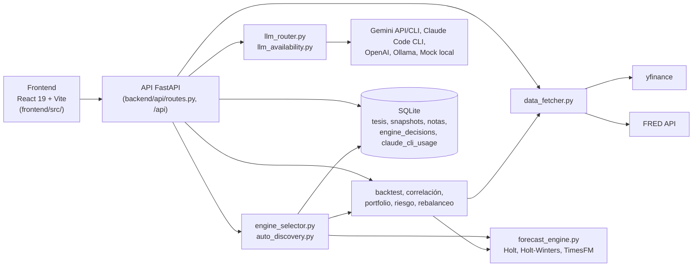

# TimeInvestor

Motor cuantitativo y de proyección de tesis de inversión: ingesta datos reales
de mercado (yfinance) y macro (FRED), proyecta series temporales, hace backtest
walk-forward contra un benchmark naive, optimiza carteras (Markowitz / Risk
Parity), simula rebalanceo con costos de transacción, y usa un LLM (Gemini
API, Gemini CLI, Claude Code CLI, OpenAI, Ollama o un motor heurístico local)
para traducir una tesis en lenguaje natural a una selección de activos.

## Visión general



El detalle de cada flujo (tesis, selección de motor, decisiones cacheadas,
horizontes, procedencia de datos, workflow) está en
[`docs/ARCHITECTURE.md`](docs/ARCHITECTURE.md), y las decisiones de diseño con
sus motivos en [`docs/adr/`](docs/adr/README.md).

## Quickstart

```bash
cp .env.example .env   # completar FRED_API_KEY / GEMINI_API_KEY según necesidad
python -m venv .venv
.venv\Scripts\activate          # Windows; en Linux/macOS: source .venv/bin/activate
pip install -r requirements.lock
python run.py           # compila el frontend si hace falta y sirve todo en :8000
```

Ver `.env.example` para el detalle de cada variable de entorno.

Instalá siempre dentro de `.venv` (está en `.gitignore`), no en el Python
global: un `pip install` suelto en el global puede actualizar pandas, yfinance,
etc. por fuera de lo verificado, y entonces lo que corre localmente deja de ser
lo que instala Docker.

### Dependencias: rangos y lock

- `requirements.txt`: rangos, se editan a mano.
- `requirements.lock`: versiones exactas, **generado** a partir de
  `requirements.txt`. Es lo que instalan `.venv` y Docker. Es un solo archivo
  para Windows y Linux (marcadores de plataforma, por ejemplo `uvloop` solo
  fuera de Windows).
- `requirements-timesfm.txt` (opcional) queda fuera del lock, porque el wheel de
  `torch` depende del hardware (CPU acá, CUDA en `Dockerfile.timesfm`). Se
  instala restringido por el lock, para que no mueva numpy, pandas, etc.:

```bash
pip install torch --index-url https://download.pytorch.org/whl/cpu -c requirements.lock
pip install -r requirements-timesfm.txt -c requirements.lock
```

Para actualizar el lock después de cambiar un rango (con
[uv](https://github.com/astral-sh/uv)):

```bash
uv pip compile requirements.txt --universal --python-version 3.12 -o requirements.lock
```

Antes de commitear un lock nuevo, instalalo en un venv limpio y corré la suite y
`scripts/smoke_real_data.py` (ver abajo).

### Smoke test con datos reales

La suite de tests mockea yfinance y FRED. Para comparar dos entornos contra
datos reales: `python scripts/smoke_real_data.py --out a.json` en cada uno, y
después `python scripts/smoke_real_data.py --compare a.json b.json`. Necesita
`FRED_API_KEY`. Yahoo devuelve cierres que varían ~1e-4 USD entre descargas, y
eso puede mover el tercer decimal del MASE. Para comparar solo el cálculo sobre
los mismos datos: `python scripts/smoke_real_data.py --replay a.json --out b.json`
en el otro entorno, y después `--compare a.json b.json`.

### Desarrollo (backend y frontend por separado)

```bash
# Backend
pip install -r requirements.lock
python run.py --no-browser

# Frontend (hot reload)
cd frontend
npm install
npm run dev
```

### Tests

```bash
python -m pytest tests/          # backend
cd frontend && npm run test      # frontend
```

### Docker

```bash
docker compose up --build
```

La imagen default (`Dockerfile`) es liviana: no instala `torch`/`transformers`.
Para el motor real de TimesFM (PyTorch + CUDA), ver `Dockerfile.timesfm` y
`requirements-timesfm.txt`.

## Selección de motor de proyección, por serie

TimeInvestor no usa un único motor de proyección para todo el sistema.
`EngineSelector` (`backend/services/engine_selector.py`) elige el motor **por
serie**, según qué demostró funcionar mejor con datos reales, no según qué
"debería" andar mejor. En orden:

| Caso | Motor | Evidencia |
|---|---|---|
| Serie FRED estacional del catálogo: `IPG2211A2N`, `HOUSTNSA`, `RSAFSNA` | **TimesFM** (plan B: Holt-Winters) | Contra Holt-Winters, en 24 cutoffs pareados: firme en IPG2211A2N; probable en HOUSTNSA y RSAFSNA ([`seasonal_benchmark`](docs/results/seasonal_benchmark_2026-09-26.md)) |
| Serie FRED estacional del catálogo: `MRTSSM4451USN` | **Holt-Winters** | TimesFM no le ganó de forma significativa (16 de 24, p = 0,152) |
| Índice/ETF del catálogo: `SPY`, `QQQ`, `XLE`, `XLK` | **Holt** | TimesFM no ganó en ninguno (0/4) en el benchmark original |
| Cualquier otra serie con 90 puntos o más | **Auto-discovery** (criterio v9) | Mini-backtest propio en el horizonte canónico de la frecuencia (diaria 60, semanal 13, mensual 12, trimestral 4) y 8 cutoffs recientes; TimesFM gana solo con mayoría de cutoffs y 10% de margen; si no, el motor base (Holt, o Holt-Winters si es estacional). Decisión cacheada en SQLite |
| Menos de 90 puntos | **Holt** (baja confianza) | Ninguna ventana corta favoreció a TimesFM |

Si TimesFM no puede correr, se pasa al plan B con el motivo: Holt-Winters si
la serie es estacional, Holt si no.

Cada respuesta de `/api/forecast` incluye:
- `engine_selection_reason`: por qué se eligió ese motor para esa serie;
- `decision_horizon`: a qué horizonte se evaluó ese motor;
- `reliable` / `reliability_warning`: si el pronóstico se mueve más del doble
  de lo máximo que la serie se movió en ese horizonte, se marca "no
  confiable", sin recortar ningún número.

El horizonte se pide y se muestra **en la unidad de la serie**: 12 en una
mensual son 12 meses; 60 en una diaria, 60 días hábiles.

## Glosario de series FRED

Los IDs de FRED (`IPG2211A2N`, `PCU221110221110`, ...) no son autoexplicativos.
El endpoint `GET /api/catalog/fred-metadata?series_id=X` devuelve el `title` y
`notes` reales que FRED publica para esa serie (nunca una descripción escrita
a mano) — visible en la interfaz como un ícono (ⓘ) junto a cada tab de serie
FRED en "Serie Activa:".

## Mensajes de fallback accionables

Cuando el LLM configurado falla y el sistema cae al motor heurístico local, la
respuesta incluye `fallback_category` (`rate_limit` / `transient` /
`auth_or_config` / `content_filtered` / `unknown`), para que el usuario sepa
si conviene esperar, si necesita revisar su configuración, o si Gemini bloqueó
la respuesta por su filtro de contenido (este último caso no se arregla ni
esperando ni reconfigurando — hay que reformular la tesis) — mostrado en el
tooltip del badge de proveedor LLM en el frontend.

## Proveedores LLM por suscripción (Gemini CLI / Claude Code CLI)

La API key gratuita de Gemini (250 req/día, 10 RPM) puede quedarse corta para
uso real, y habilitar facturación de API por separado —para Gemini o para
Claude— no siempre es lo que querés. Ambos proveedores oficiales tienen un CLI
que se autentica con tu **sesión de suscripción** (Google AI Pro / Claude
Pro-Max) en vez de una API key facturada por uso. `GeminiCliLLMClient` y
`ClaudeCliLLMClient` (`backend/services/llm_router.py`) usan esos CLIs — son
proveedores **nuevos**, no reemplazan a `GeminiLLMClient` (API key) ni a
`MockLLMClient`, que siguen disponibles.

### Instalación (una vez, herramientas de Node — no forman parte de `pip install`)

```bash
npm install -g @google/gemini-cli
npm install -g @anthropic-ai/claude-code
```

### Login (manual, interactivo, una sola vez por máquina — no lo automatices)

```bash
gemini   # elegí "Sign in with Google" y segui el flujo en el navegador
claude   # si Claude Code ya lo usás interactivamente en esta máquina, ya estás logueado
```

Las credenciales quedan cacheadas localmente:
- Gemini CLI: `~/.gemini/oauth_creds.json` (confirmado leyendo el código fuente
  instalado del paquete — `Storage.getGlobalGeminiDir()` en
  `@google/gemini-cli`). Borrar ese archivo fuerza un nuevo login.
- Claude Code CLI: usa el mismo mecanismo de sesión que Claude Code interactivo
  ya tiene guardado en esta máquina — si `claude --version` ya funciona sin
  pedir login, ya estás autenticado.

### Activar cada uno

```bash
# En tu .env
LLM_PROVIDER=gemini_cli
# o
LLM_PROVIDER=claude_cli
CLAUDE_CLI_MODEL=sonnet  # default (ADR-0031); "haiku" gasta menos cupo compartido, con peor calidad medida
```

Ninguno de los dos es el default en `.env.example` — ambos requieren
instalación y login manual primero. Si el binario correspondiente no está
instalado o no hay sesión iniciada, el sistema degrada a `MockLLMClient` con
la razón específica (`fallback_category="auth_or_config"`), nunca crashea el
servidor al arrancar.

### ⚠️ Diferencia importante de cuota — leé esto antes de elegir uno

|  | Gemini CLI | Claude Code CLI |
|---|---|---|
| Cuota | **Independiente** de cualquier otro uso de Gemini (API key, AI Studio) | **Compartida** con TODO el resto de tu uso de Claude |
| Límite (Google AI Pro) | ~1000 req/día, 60 RPM | Ventana rodante de 5 horas + tope semanal |
| Qué más consume la misma cuota | Nada — es un cupo aparte | Claude Code interactivo, chat de claude.ai, cualquier otra sesión de Claude en tu cuenta |

**Esto cambia cuándo conviene usar cada uno.** `gemini_cli` es seguro de dejar
prendido de forma continua: no le quita cupo a nada más. `claude_cli` en
cambio gasta del mismo cupo que estás usando ahora mismo para trabajar con
Claude Code — cada tesis que este proyecto analiza con `claude_cli` es una
llamada menos de cupo disponible para tu sesión interactiva. Preferí
`gemini_cli` como default razonable, y reservá `claude_cli` para cuando
específicamente querés la calidad de Claude y sabés que tenés cupo de sobra.

### Solo para uso local — no funciona en la imagen Docker

Ambos requieren el login interactivo por navegador la primera vez. La imagen
Docker (`Dockerfile`/`docker-compose.yml`) corre headless, sin navegador ni
sesión de usuario — no hay forma limpia de hacer ese login ahí. Si corrés en
Docker, seguí usando `GeminiLLMClient` (API key) o `MockLLMClient`. Esta
limitación queda anotada como conocida, no resuelta en esta ronda.

### Costo de Claude CLI (no es facturación — es visibilidad de cupo)

Cada respuesta de `claude -p ... --output-format json` incluye un
`total_cost_usd` equivalente (lo que hubiera costado como API pagada, aunque
acá corre por suscripción). `ClaudeCliLLMClient` acumula ese valor por día y
modelo en SQLite (tabla `claude_cli_usage`) y lo loguea — es la única forma de
ver cuánto de tu cupo compartido de 5h/semanal está gastando esta
funcionalidad específicamente, ya que esa cuota no es visible desde ningún
otro lado del proyecto.

## Cambiar de proveedor LLM desde la UI (sin reiniciar)

En el Header, al lado de los badges `TimesFM` / `SQLite`, el selector
**LLM: …** muestra el proveedor activo y permite cambiarlo en caliente. La
próxima tesis que se analice ya usa el nuevo proveedor — `get_llm_client()`
lee `settings.LLM_PROVIDER` en cada request, no hace falta reiniciar nada.

> **El cambio es solo en memoria.** No se escribe nada a `.env`. Si el server
> se reinicia, vuelve al `LLM_PROVIDER` de tu `.env`. Para dejarlo fijo,
> editá `.env` vos mismo. La app nunca escribe ese archivo a propósito: no hace
> falta para esto y es innecesariamente riesgoso.

Los proveedores sin sus prerequisitos aparecen **deshabilitados, con el
motivo** (mismo criterio que las series FRED sin `FRED_API_KEY`: no se ofrece
algo que sabemos que va a fallar sin decir por qué):

| Proveedor | Disponible si… | Cómo se verifica (sin gastar una llamada al modelo) |
|---|---|---|
| `gemini` | hay `GEMINI_API_KEY` | lectura de settings |
| `openai` | hay `OPENAI_API_KEY` | lectura de settings |
| `gemini_cli` | `gemini` está en el PATH **y** hay sesión iniciada | `shutil.which` + existencia de `~/.gemini/oauth_creds.json` (o `gemini-credentials.json` en modo cifrado) |
| `claude_cli` | `claude` está en el PATH **y** hay sesión iniciada | `shutil.which` + `claude auth status --json` → `loggedIn` |
| `ollama` | Ollama responde en `OLLAMA_BASE_URL` | `GET /api/tags` con timeout de 1.5 s |
| `mock` | siempre | — |

Los chequeos de CLI y Ollama se cachean 60 s, para no relanzar procesos en
cada apertura del dropdown (`GET /api/config/llm-providers?refresh=true`
ignora el cache).

Junto a `claude_cli` el dropdown recuerda *"Comparte cupo con tu uso de Claude
Code"* (ver la tabla de cuotas más arriba).

API:

```bash
curl localhost:8000/api/config/llm-providers
curl -X POST localhost:8000/api/config/llm-provider \
     -H 'Content-Type: application/json' -d '{"provider": "gemini_cli"}'
# → {"active": "gemini_cli", "previous": "gemini", "persisted": false, "notice": "Válido hasta el próximo reinicio…"}
```

Un proveedor desconocido o no disponible devuelve **400** con el motivo, y el
proveedor activo no cambia.
