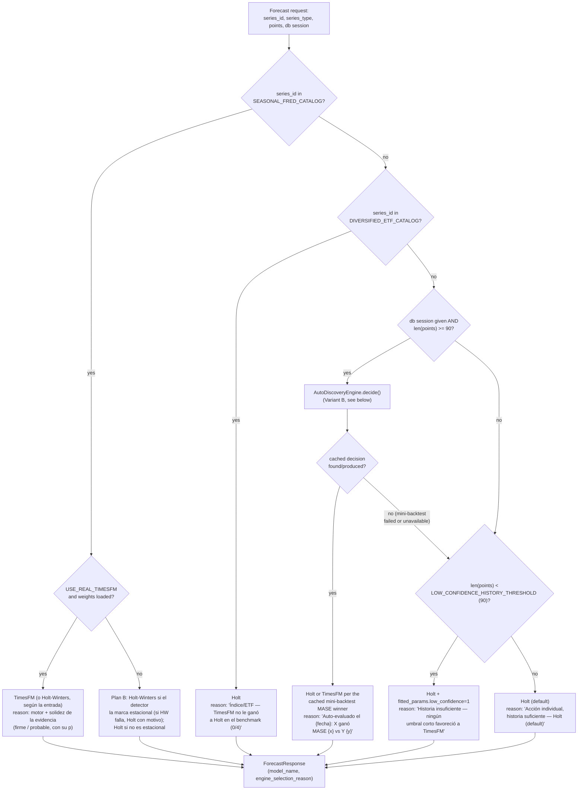
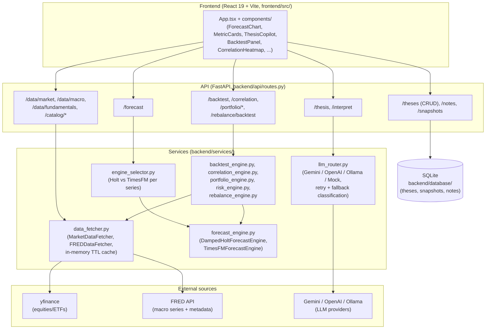

# Engine Selection Architecture

## EngineSelector decision flow

How `EngineSelector.select()` picks an engine for one specific forecast
request, given a series' identity, type, and available history:

## Current state: Variant A — curated catalogs (implemented)

`backend/services/engine_selector.py`'s `EngineSelector` picks Holt vs TimesFM
per series using **explicit, hand-curated catalogs** (`SEASONAL_FRED_CATALOG`,
`DIVERSIFIED_ETF_CATALOG`), each backed by a one-time walk-forward benchmark
over real data (`scripts/benchmark_real_data.py`). See that module's docstring
for the full results table and rationale per category.

This is cheap (one inference per forecast request, same as before) but has two
structural limitations:

1. **Coverage gap**: any series not in a curated catalog and not obviously
   "individual equity" (e.g. a new ETF, a foreign index, a commodity) gets no
   evidence-based routing — it silently falls into the default (Holt).
2. **Staleness**: the catalogs reflect one benchmark run on one snapshot of
   market/macro data. Regime changes (e.g. TimesFM's foundation-model training
   distribution drifting relative to markets over years) require re-running
   the benchmark script and manually updating the catalogs — there's no
   feedback loop that keeps the routing current on its own.

## Variant B (implemented): real-time per-series mini-backtest, cached

`backend/services/auto_discovery.py`'s `AutoDiscoveryEngine` implements what
this section originally only proposed. Any series outside both curated
catalogs, with enough history (`n_points >= 90`, same threshold as the
cold-start check), gets its own evidence instead of silently defaulting to
Holt without ever being measured — this was the scaling problem with
Variant A alone: a series Gemini brings back that was never part of the
original benchmark round (e.g. `IPG3344S`, a semiconductor manufacturing
FRED series) got no evidence-based routing at all before this existed.

How it works:

1. Take the series' available history (re-fetched via `BacktestEngine`, which
   already knows how to pull FRED vs. yfinance data — reused, not duplicated).
2. Pick 3 cutoffs spaced over that history, each leaving `MINI_BACKTEST_HORIZON`
   (30) points for evaluation — mirrors `scripts/benchmark_real_data.py`'s own
   walk-forward spacing, at a cheaper 3-cutoff scale.
3. At each cutoff, run **both** Holt and TimesFM (via
   `BacktestEngine.run_backtest(engine_override=...)`, a new optional parameter
   that forces a specific engine instance instead of the global default) and
   record MASE and interval coverage.
4. TimesFM only wins if it beats Holt's mean MASE **and** its mean interval
   coverage isn't more than 30 points below Holt's (`MAX_ACCEPTABLE_COVERAGE_GAP_PP`)
   — winning on MASE at the cost of a catastrophically uncalibrated interval
   doesn't count as a real win.
5. The decision (`engine_choice`, `mase_holt`, `mase_timesfm`, `evaluated_at`,
   `n_points_at_evaluation`) is cached in SQLite (`engine_decisions` table, one
   row per `series_id`) — chosen over a flat file since this project already
   uses SQLAlchemy/SQLite for theses/snapshots/notes, and a per-series decision
   with fields that need querying/updating fits that pattern better than
   reading-and-rewriting a JSON blob.
6. Every later request for the same series is a single indexed lookup — no
   inference re-run — until the decision goes stale.

**Invalidation** (any one of these triggers re-evaluation):
- More than `DECISION_TTL_DAYS` (30) since `evaluated_at` — a regime shift
  shouldn't be locked in forever from one measurement.
- The series has grown by `STALE_GROWTH_FRACTION` (20%) or more new points
  since `n_points_at_evaluation` — e.g. a daily equity accumulating ~21 new
  trading days/month eventually has enough new signal to be worth re-checking
  independent of the calendar.
- The decision was taken **without TimesFM** (`mase_timesfm IS NULL`) and
  TimesFM is available now. "TimesFM never ran" is not "Holt won": Holt wasn't
  compared against anything, so it's re-evaluated right away instead of waiting
  out the TTL. While TimesFM is still unavailable the cached decision is served
  as-is (re-running would be Holt-only again). The check is
  `TimesFMForecastEngine.is_available()`: it doesn't touch the model with
  `USE_REAL_TIMESFM=false`, and otherwise loads it at most once per process
  (a failed load is never retried), so asking on every request is cheap.
  No schema change: `mase_timesfm` was already nullable and `NULL` already
  meant exactly this, so existing databases keep working as they are.

**TimesFM falling back inside the mini-backtest.** A loaded TimesFM can still
fail on a given cutoff; `TimesFMForecastEngine.forecast()` then answers with
Holt, and `BacktestResponse.is_fallback` says so. That cutoff is dropped for
both engines (the comparison stays paired over the same cutoffs) and counted
in `engine_decisions.timesfm_failed_cutoffs`. If it fails on every cutoff,
`mase_timesfm` stays `NULL` but `timesfm_failed_cutoffs > 0`: that is not
"no evaluado", so it waits for the regular TTL instead of re-running on every
request. The column was added later; `init_db()` adds it to existing databases
(`migrate_added_columns`), and old rows read as `NULL` with the old meaning.

A failed mini-backtest (e.g. a data-provider hiccup) is caught and logged, and
`decide()` returns `None` (or a stale cached decision if one exists) rather
than raising — the actual `/forecast` request that triggered it must not break
just because the auto-discovery side-quest failed.

The curated catalogs (`SEASONAL_FRED_CATALOG`, `DIVERSIFIED_ETF_CATALOG`) are
checked FIRST and remain a fast, free shortcut for the series already measured
in the original benchmark round — auto-discovery only runs for series outside
both.

### Measured cost

A **new** series' first forecast request pays for 3 cutoffs × 2 engines = up
to 6 backtests (each re-fetching data and running one inference), before the
real forecast is even served. Measured on this repo's dev machine (CPU,
`USE_REAL_TIMESFM=true`, real fetched data):

| Series | Call | Latency |
|---|---|---|
| JNJ (equity) | 1st (triggers mini-backtest) | ~4.3 s |
| JNJ (equity) | 2nd (cached decision) | ~0.13 s |
| IPG3344S (FRED, uncatalogued) | 1st (triggers mini-backtest) | ~3.4 s |
| IPG3344S (FRED, uncatalogued) | 2nd (cached decision) | ~0.02 s |
| XOM (equity) | 1st (triggers mini-backtest) | ~4.2 s |

So: **~3-20x slower on the first request for a genuinely new series**, back to
normal (a single engine call, same as before this feature) on every request
after — this matches the "mitigation" this section originally proposed before
implementation (cache the decision, not the forecast; only trigger the
expensive path for series outside the cheap catalogs) rather than the more
elaborate async/background variant, which was judged unnecessary complexity
for a cost this localized (one slow request per series, ever, per TTL window).

## General architecture

The main blocks, for someone new to the codebase — not exhaustive at the file
level, just enough to place where a change would live:

