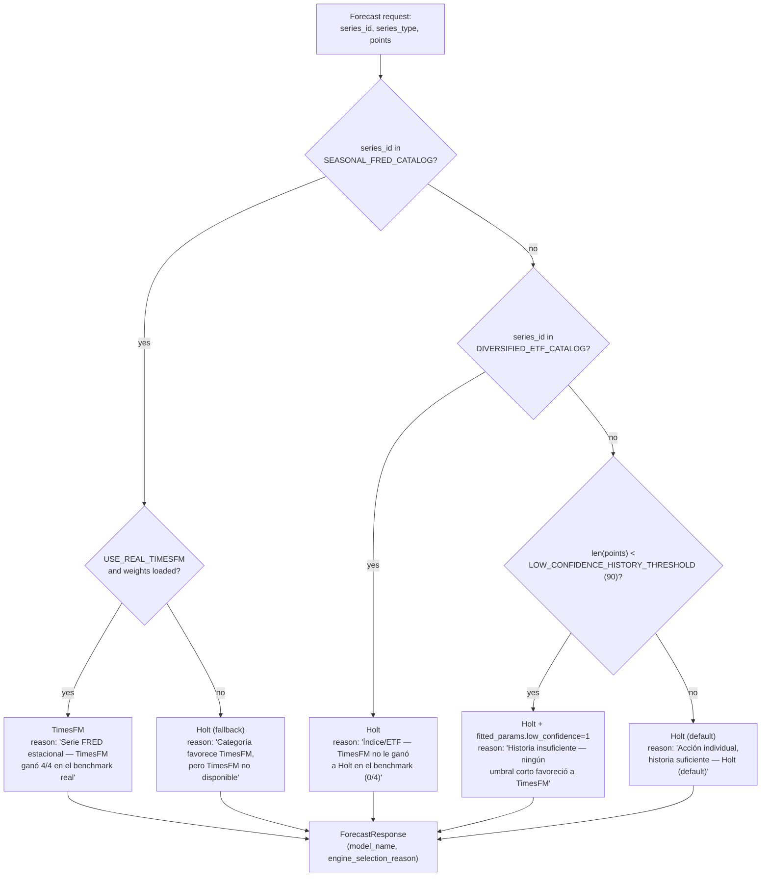
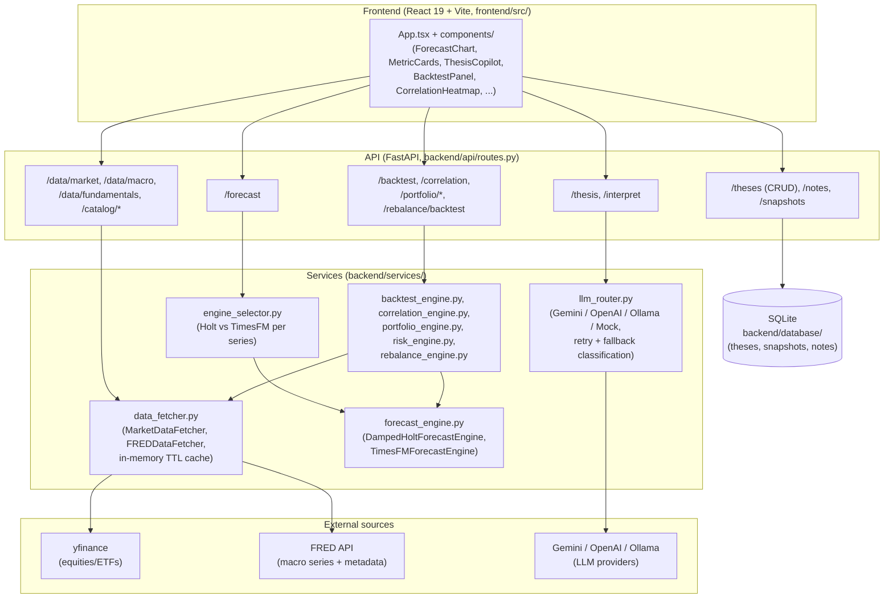

# Engine Selection Architecture

## EngineSelector decision flow

How `EngineSelector.select()` picks an engine for one specific forecast
request, given a series' identity, type, and available history:

## Current state: Variant A — curated catalogs (implemented)

`backend/services/engine_selector.py`'s `EngineSelector` picks Holt vs TimesFM
per series using **explicit, hand-curated catalogs** (`SEASONAL_FRED_CATALOG`,
`DIVERSIFIED_ETF_CATALOG`), each backed by a one-time walk-forward benchmark
over real data (`scripts/benchmark_real_data.py`). See that module's docstring
for the full results table and rationale per category.

This is cheap (one inference per forecast request, same as before) but has two
structural limitations:

1. **Coverage gap**: any series not in a curated catalog and not obviously
   "individual equity" (e.g. a new ETF, a foreign index, a commodity) gets no
   evidence-based routing — it silently falls into the default (Holt).
2. **Staleness**: the catalogs reflect one benchmark run on one snapshot of
   market/macro data. Regime changes (e.g. TimesFM's foundation-model training
   distribution drifting relative to markets over years) require re-running
   the benchmark script and manually updating the catalogs — there's no
   feedback loop that keeps the routing current on its own.

## Variant B (not implemented): real-time per-series mini-backtest

Instead of consulting a static catalog, run a **small walk-forward backtest on
the specific series being forecast**, right before serving the real forecast:

1. Take the series' available history (whatever was fetched for this request).
2. Pick 2-3 cutoffs near the end of that history (e.g. leaving the last 10-20
   points out at each cutoff).
3. At each cutoff, run **both** Holt and TimesFM forward over a short horizon
   (e.g. 5-10 steps) and compute MASE against the actually-known held-out data.
4. Pick whichever engine had the lower mean MASE across those cutoffs.
5. Run the *winning* engine one more time on the full history at the real
   requested horizon, and serve that as the forecast.

This eliminates the need for curated catalogs entirely — every series gets its
own evidence, not a category's aggregate evidence — and adapts automatically
to regime changes without a human re-running a benchmark script and editing a
Python set literal.

### Why not implemented now: added latency

This requires up to **2×3 + 1 = 7 inferences** per forecast request in the
worst case (3 cutoffs × 2 engines, plus the final real forecast), instead of 1.
TimesFM dominates that cost — its inference is far slower than Holt's closed-form
fit on this project's hardware (see `scripts/download_and_benchmark_timesfm.py`'s
latency benchmark, context=512, CPU, this repo's dev machine):

| Engine | Horizon | p50 latency |
|---|---|---|
| Damped Holt MLE | 30 | ~65 ms |
| Damped Holt MLE | 60 | ~103 ms |
| Damped Holt MLE | 90 | ~105 ms |
| TimesFM 2.5 (200M, CPU) | 30 | ~349 ms |
| TimesFM 2.5 (200M, CPU) | 60 | ~332 ms |
| TimesFM 2.5 (200M, CPU) | 90 | ~349 ms |

A single forecast request today costs one engine call: **~65-350 ms** depending
on which engine `EngineSelector` picks. Under Variant B, assuming a short
mini-backtest horizon (so TimesFM's mini-backtest calls cost close to its H=30
number, ~350 ms each) and 3 cutoffs:

- Mini-backtest phase: 3 × (Holt ~65 ms + TimesFM ~350 ms) ≈ **1.25 s**
- Final real forecast: whichever engine won, ~65-350 ms
- **Total: ~1.3-1.6 s per forecast request**, vs ~0.07-0.35 s today —
  roughly **4-20x slower**, entirely dominated by TimesFM's per-call cost on CPU
  (a GPU deployment would shrink this gap substantially, per the
  `Dockerfile.timesfm` CUDA build, but this project doesn't run on GPU by default).

Whether that's acceptable depends on how forecasts are consumed: a single
on-demand `/forecast` call in the UI can likely absorb ~1.5s; a batch job
scoring hundreds of thesis tickers per run would multiply that into minutes.
This tradeoff — universal, self-adapting per-series accuracy vs. a ~5-20x
latency cost concentrated in TimesFM's own inference time — is the deciding
factor for a future phase, not something to resolve preemptively here.

### Possible mitigations if this is built later

- Cache the per-series engine choice (not the forecast itself) for some TTL,
  so the mini-backtest only re-runs periodically per series instead of on
  every request — trades staleness for latency, the same tradeoff Variant A
  already makes, just on a shorter cycle.
- Run the mini-backtest asynchronously/in the background after serving a fast
  default-engine forecast immediately, then only apply the "better" engine's
  choice on the *next* request for that series (accepts one stale request
  per series instead of paying the cost synchronously every time).
- Only trigger the mini-backtest for series outside both curated catalogs
  (i.e. keep Variant A's cheap path for known categories, and use Variant B's
  expensive path only as a fallback for genuinely novel series) — a hybrid
  that keeps the common case cheap.

## General architecture

The main blocks, for someone new to the codebase — not exhaustive at the file
level, just enough to place where a change would live:

