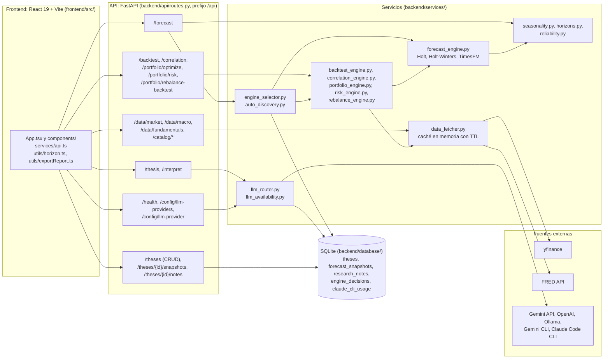
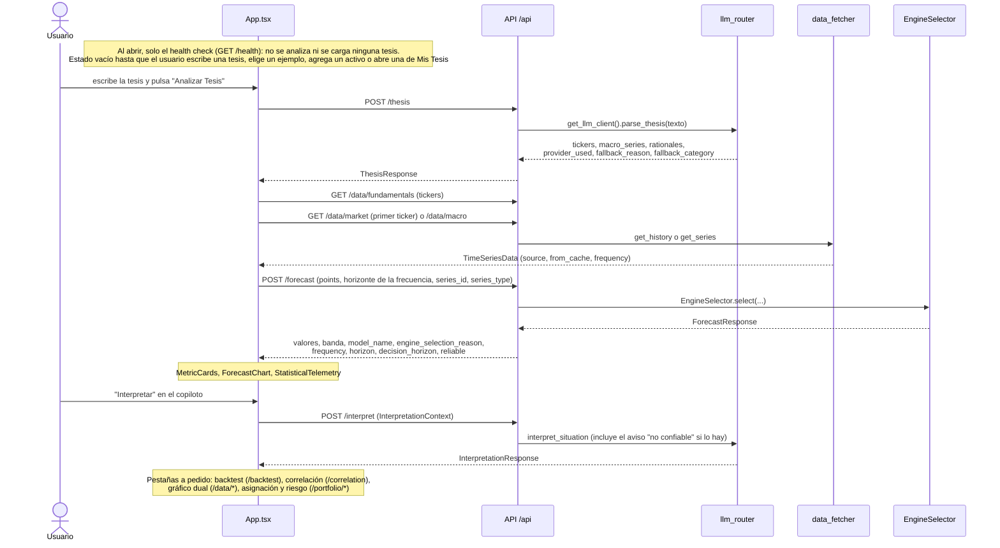
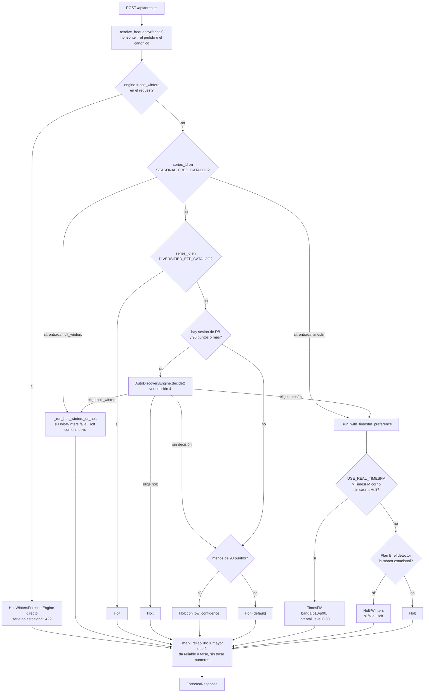
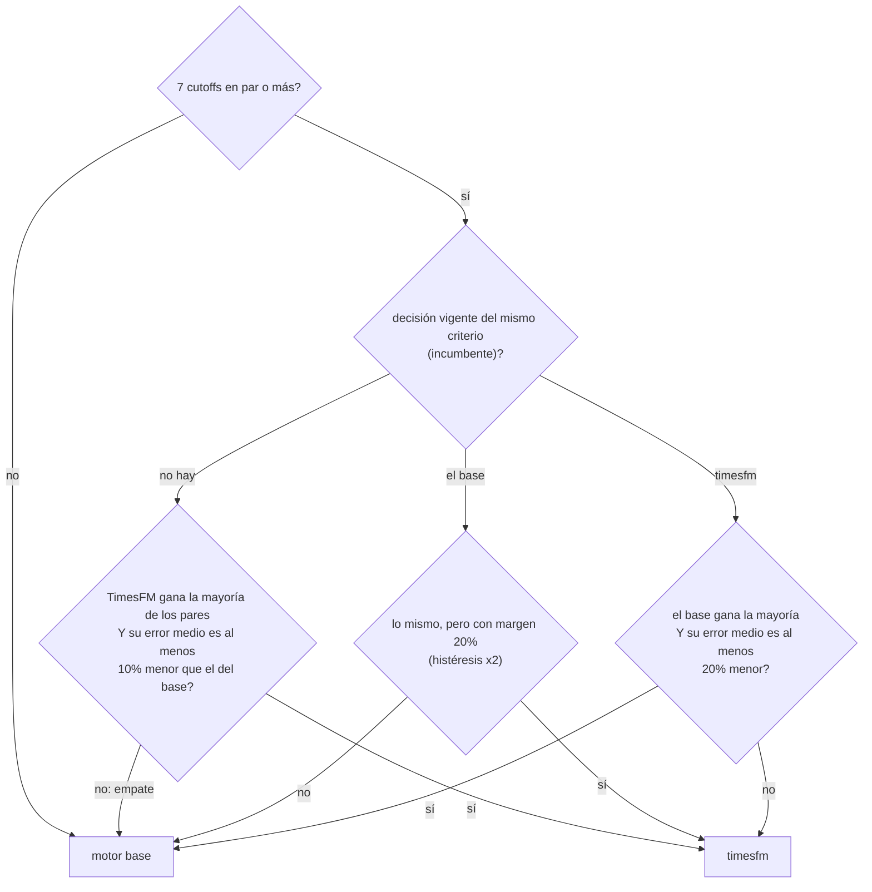
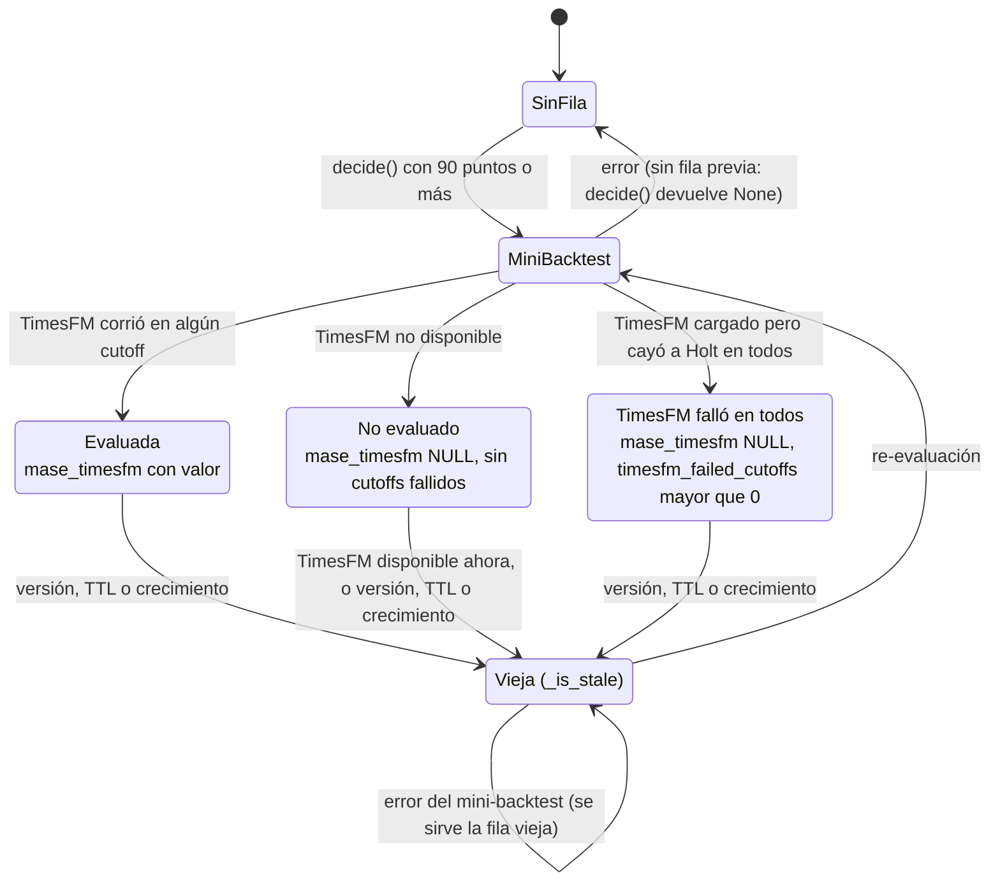
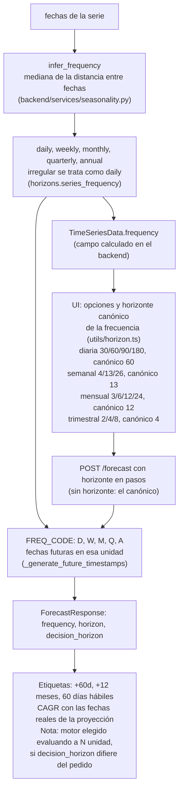
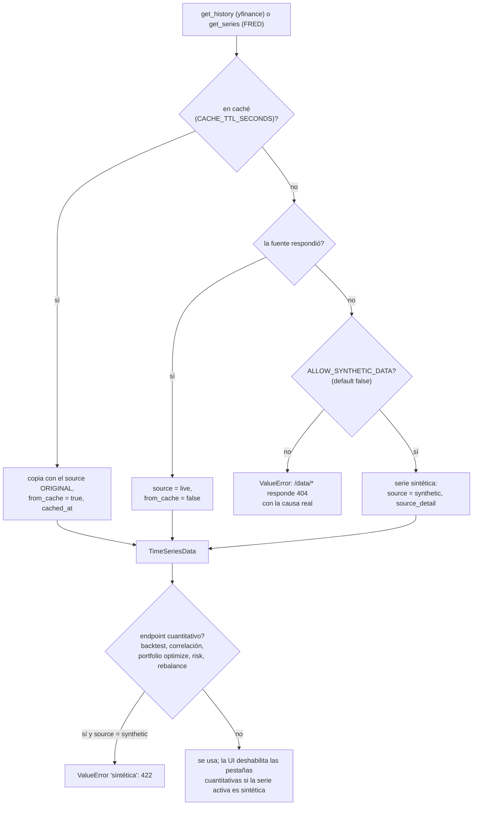
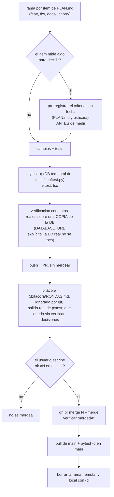

# Arquitectura

Cómo está armado TimeInvestor hoy (`main` @ `16b6782`, 2026-09-27). Cada
diagrama describe el código real y nombra los archivos donde vive cada
parte. Las decisiones de diseño y sus motivos están en [`docs/adr/`](adr/);
el trabajo pendiente, en [`docs/PLAN.md`](PLAN.md).

## 1. Visión general

```mermaid
flowchart LR
    subgraph FE["Frontend: React 19 + Vite (frontend/src/)"]
        APP["App.tsx y components/<br/>services/api.ts<br/>utils/horizon.ts, utils/exportReport.ts"]
    end

    subgraph API["API: FastAPI (backend/api/routes.py, prefijo /api)"]
        RT["/thesis, /interpret"]
        RD["/data/market, /data/macro,<br/>/data/fundamentals, /catalog/*"]
        RF["/forecast"]
        RQ["/backtest, /correlation,<br/>/portfolio/optimize, /portfolio/risk,<br/>/portfolio/rebalance-backtest"]
        RP["/theses (CRUD),<br/>/theses/{id}/snapshots, /theses/{id}/notes"]
        RC["/health, /config/llm-providers,<br/>/config/llm-provider"]
    end

    subgraph SV["Servicios (backend/services/)"]
        LLM["llm_router.py<br/>llm_availability.py"]
        DF["data_fetcher.py<br/>caché en memoria con TTL"]
        SEL["engine_selector.py<br/>auto_discovery.py"]
        ENG["forecast_engine.py<br/>Holt, Holt-Winters, TimesFM"]
        AUX["seasonality.py, horizons.py,<br/>reliability.py"]
        QNT["backtest_engine.py, correlation_engine.py,<br/>portfolio_engine.py, risk_engine.py,<br/>rebalance_engine.py"]
    end

    subgraph EXT["Fuentes externas"]
        YF["yfinance"]
        FRED["FRED API"]
        LLMX["Gemini API, OpenAI, Ollama,<br/>Gemini CLI, Claude Code CLI"]
    end

    DB[("SQLite (backend/database/)<br/>theses, forecast_snapshots, research_notes,<br/>engine_decisions, claude_cli_usage")]

    APP --> RT & RD & RF & RQ & RP & RC
    RT --> LLM
    RC --> LLM
    RD --> DF
    RF --> SEL
    RF --> AUX
    RQ --> QNT
    RP --> DB
    SEL --> ENG
    SEL --> DB
    SEL --> QNT
    QNT --> DF
    QNT --> ENG
    ENG --> AUX
    LLM --> LLMX
    LLM --> DB
    DF --> YF
    DF --> FRED
```

- `SEL --> QNT`: el auto-discovery corre el mini-backtest con
  `BacktestEngine`, no con una copia propia.
- `LLM --> DB`: `ClaudeCliLLMClient` acumula el costo equivalente por día y
  modelo en `claude_cli_usage`.
- `MockLLMClient` (heurística local, sin red) es el proveedor de respaldo de
  todos los demás.

## 2. Flujo de una tesis

```mermaid
sequenceDiagram
    actor U as Usuario
    participant UI as App.tsx
    participant API as API /api
    participant LLM as llm_router
    participant DF as data_fetcher
    participant SEL as EngineSelector

    Note over UI: Al abrir, solo el health check (GET /health): no se analiza ni se carga ninguna tesis.<br/>Estado vacío hasta que el usuario escribe una tesis, elige un ejemplo, agrega un activo o abre una de Mis Tesis
    U->>UI: escribe la tesis y pulsa "Analizar Tesis"
    UI->>API: POST /thesis
    API->>LLM: get_llm_client().parse_thesis(texto)
    LLM-->>API: tickers, macro_series, rationales,<br/>provider_used, fallback_reason, fallback_category
    API-->>UI: ThesisResponse
    UI->>API: GET /data/fundamentals (tickers)
    UI->>API: GET /data/market (primer ticker) o /data/macro
    API->>DF: get_history o get_series
    DF-->>UI: TimeSeriesData (source, from_cache, frequency)
    UI->>API: POST /forecast (points, horizonte de la frecuencia, series_id, series_type)
    API->>SEL: EngineSelector.select(...)
    SEL-->>API: ForecastResponse
    API-->>UI: valores, banda, model_name, engine_selection_reason,<br/>frequency, horizon, decision_horizon, reliable
    Note over UI: MetricCards, ForecastChart, StatisticalTelemetry
    U->>UI: "Interpretar" en el copiloto
    UI->>API: POST /interpret (InterpretationContext)
    API->>LLM: interpret_situation (incluye el aviso "no confiable" si lo hay)
    LLM-->>UI: InterpretationResponse
    Note over UI: Pestañas a pedido: backtest (/backtest), correlación (/correlation),<br/>gráfico dual (/data/*), asignación y riesgo (/portfolio/*)
```

Archivos: `frontend/src/App.tsx` (`handleAnalyzeThesis`,
`loadSeriesAndForecast`), `backend/api/routes.py`,
`backend/services/llm_router.py`, `backend/services/data_fetcher.py`,
`backend/services/engine_selector.py`.

## 3. Selección de motor

`EngineSelector.select()` (`backend/services/engine_selector.py`) elige el
motor **por serie**. El endpoint (`routes.generate_forecast`) resuelve antes
la frecuencia y el horizonte, y después marca la confiabilidad.

```mermaid
flowchart TD
    REQ["POST /api/forecast"] --> FQ["resolve_frequency(fechas)<br/>horizonte = el pedido o el canónico"]
    FQ --> EXP{"engine = holt_winters<br/>en el request?"}
    EXP -- sí --> HWX["HoltWintersForecastEngine directo<br/>serie no estacional: 422"]
    EXP -- no --> S1{"series_id en<br/>SEASONAL_FRED_CATALOG?"}
    S1 -- "sí, entrada timesfm" --> TP["_run_with_timesfm_preference"]
    S1 -- "sí, entrada holt_winters" --> HWO["_run_holt_winters_or_holt<br/>si Holt-Winters falla: Holt con el motivo"]
    S1 -- no --> S2{"series_id en<br/>DIVERSIFIED_ETF_CATALOG?"}
    S2 -- sí --> H1["Holt"]
    S2 -- no --> S3{"hay sesión de DB<br/>y 90 puntos o más?"}
    S3 -- sí --> AD["AutoDiscoveryEngine.decide()<br/>ver sección 4"]
    AD -- "elige timesfm" --> TP
    AD -- "elige holt_winters" --> HWO
    AD -- "elige holt" --> H2["Holt"]
    AD -- "sin decisión" --> S4
    S3 -- no --> S4{"menos de 90 puntos?"}
    S4 -- sí --> H3["Holt con low_confidence"]
    S4 -- no --> H4["Holt (default)"]
    TP --> TQ{"USE_REAL_TIMESFM<br/>y TimesFM corrió<br/>sin caer a Holt?"}
    TQ -- sí --> TFM["TimesFM<br/>banda p10-p90, interval_level 0,80"]
    TQ -- no --> PB{"Plan B: el detector<br/>la marca estacional?"}
    PB -- sí --> HWB["Holt-Winters<br/>si falla: Holt"]
    PB -- no --> HB["Holt"]
    HWX & HWO & H1 & H2 & H3 & H4 & TFM & HWB & HB --> REL["_mark_reliability: X mayor que 2<br/>da reliable = false, sin tocar números"]
    REL --> RESP["ForecastResponse"]
```

- **`decision_horizon`**: cuando el motor sale de una evaluación, la
  respuesta dice a qué horizonte se evaluó. Catálogo estacional, 12
  (`scripts/seasonal_benchmark.py`); catálogo de ETFs, 30
  (`scripts/benchmark_real_data.py`); auto-discovery, el `horizon` de la
  decisión. Las respuestas de plan B no lo llevan (`is_fallback = true`).
- **Catálogos** (`SEASONAL_FRED_CATALOG`, `DIVERSIFIED_ETF_CATALOG`): se
  consultan primero. Cada entrada estacional trae su motor, la solidez de la
  evidencia (test de signo pareado y Bonferroni, 3.0c+d) y la referencia al
  resultado.
- **Auto-discovery** (`backend/services/auto_discovery.py`): cubre cualquier
  serie fuera de los catálogos con 90 puntos o más. El mini-backtest
  (criterio v7) toma 8 cutoffs repartidos en una ventana reciente según la
  frecuencia (`RECENT_WINDOW`: 504 puntos en diarias, 104 en semanales, 120
  en mensuales, 40 en trimestrales), cada uno con el horizonte canónico de la
  frecuencia (`_decision_horizon`: diaria 60, semanal 13, mensual 12,
  trimestral 4; hasta v4 eran 30 pasos, `MINI_BACKTEST_HORIZON`)
  puntos de evaluación, y corre en cada cutoff el motor base y TimesFM con
  `BacktestEngine.run_backtest(engine_override=...)`, los dos al 80%.
  - Motor base: Holt con MASE a un paso, o Holt-Winters con MASE estacional
    si la serie es estacional.
  - Los cutoffs donde TimesFM cayó a Holt se descartan para los dos motores
    y se cuentan en `timesfm_failed_cutoffs`.
  - Si el base rechaza un cutoff, se cuenta en `baseline_skipped_cutoffs`.

### Regla de decisión (`decide_robust`, igual en v4, v5 y v6)

- **Métrica** (v6): MASE (o MASE estacional). Si no está definido en algún
  cutoff (la serie no varió en ese entrenamiento), la serie entera usa el
  **MAE en pares** (ADR-0020).
- **Historia mínima**: `min_history_for_decision(h)` = max(30, 2h) + h + 6
  puntos (diaria 186, semanal 49, mensual 48, trimestral 40). Con menos, el
  motivo dice "Historia insuficiente para evaluar (N de M puntos): se usa
  Holt por defecto".

```mermaid
flowchart TD
    P{"7 cutoffs en par o más?"} -- no --> BASE["motor base"]
    P -- sí --> INC{"decisión vigente del mismo criterio<br/>(incumbente)?"}
    INC -- "no hay" --> W1{"TimesFM gana la mayoría de los pares<br/>Y su error medio es al menos<br/>10% menor que el del base?"}
    W1 -- sí --> TF["timesfm"]
    W1 -- "no: empate" --> BASE
    INC -- "el base" --> W2{"lo mismo, pero con margen 20%<br/>(histéresis x2)"}
    W2 -- sí --> TF
    W2 -- no --> BASE
    INC -- "timesfm" --> W3{"el base gana la mayoría<br/>Y su error medio es al menos<br/>20% menor?"}
    W3 -- sí --> BASE
    W3 -- no --> TF
```

- `DECISION_ALPHA = None`: es mayoría simple, no test de signo.
- `USE_COVERAGE_GUARD = False`: desde v4 no hay guard de cobertura.
- Mediciones: `docs/results/decision_stability_2026-09-26.md` y
  `docs/results/decision_variants_2026-09-26.md`.

## 4. Ciclo de vida de una fila de `engine_decisions`

Una fila por `series_id`, en `backend/database/models.py`
(`EngineDecisionModel`). Las columnas agregadas después se crean en bases
existentes con `migrate_added_columns` (`backend/database/connection.py`);
las filas viejas las leen como `NULL`, con su significado original.

```mermaid
stateDiagram-v2
    [*] --> SinFila
    SinFila --> MiniBacktest: decide() con 90 puntos o más
    MiniBacktest --> Evaluada: TimesFM corrió en algún cutoff
    MiniBacktest --> NoEvaluado: TimesFM no disponible
    MiniBacktest --> TFMFallo: TimesFM cargado pero cayó a Holt en todos
    MiniBacktest --> SinFila: error (sin fila previa: decide() devuelve None)
    Evaluada --> Vieja: versión, TTL o crecimiento
    NoEvaluado --> Vieja: TimesFM disponible ahora, o versión, TTL o crecimiento
    TFMFallo --> Vieja: versión, TTL o crecimiento
    Vieja --> MiniBacktest: re-evaluación
    Vieja --> Vieja: error del mini-backtest (se sirve la fila vieja)

    state "Evaluada<br/>mase_timesfm con valor" as Evaluada
    state "No evaluado<br/>mase_timesfm NULL, sin cutoffs fallidos" as NoEvaluado
    state "TimesFM falló en todos<br/>mase_timesfm NULL, timesfm_failed_cutoffs mayor que 0" as TFMFallo
    state "Vieja (_is_stale)" as Vieja
```

`_is_stale` marca una fila como vieja por cualquiera de estas razones:
- **Versión del criterio**: `criteria_version` (NULL = 1) es menor que
  `AUTO_DISCOVERY_CRITERIA_VERSION` (7). Hubo versiones 1 a 7: v2 en 3.0e
  (banda de TimesFM y nivel común de comparación), v3 en 3.0f (base
  Holt-Winters en series estacionales), v4 en 2.3, v5 en 2.3d (horizonte
  canónico), v6 en 2.10 (MAE en pares cuando el MASE no está definido) y v7
  en 2.9 (datos a la precisión de la fuente).
- **TTL**: pasaron más de `DECISION_TTL_DAYS` (30) desde `evaluated_at`.
- **Crecimiento**: la serie creció `STALE_GROWTH_FRACTION` (20%) o más en
  puntos.
- **No evaluado**: `mase_timesfm` es NULL sin cutoffs fallidos y TimesFM
  está disponible ahora.

Al re-evaluar, el `engine_choice` anterior solo actúa como incumbente (con
histéresis) si la fila es de la versión vigente; si es de una versión
anterior, se decide de cero. La fila guarda además `baseline_engine`,
`metric`, `baseline_skipped_cutoffs` y, desde 4.14, `horizon` (NULL = 30).

## 5. Horizonte y unidades

```mermaid
flowchart TD
    PTS["fechas de la serie"] --> INF["infer_frequency<br/>mediana de la distancia entre fechas<br/>(backend/services/seasonality.py)"]
    INF --> FREQ["daily, weekly, monthly, quarterly, annual<br/>irregular se trata como daily<br/>(horizons.series_frequency)"]
    FREQ --> TSD["TimeSeriesData.frequency<br/>(campo calculado en el backend)"]
    FREQ --> CODE["FREQ_CODE: D, W, M, Q, A<br/>fechas futuras en esa unidad<br/>(_generate_future_timestamps)"]
    TSD --> UIH["UI: opciones y horizonte canónico<br/>de la frecuencia (utils/horizon.ts)<br/>diaria 30/60/90/180, canónico 60<br/>semanal 4/13/26, canónico 13<br/>mensual 3/6/12/24, canónico 12<br/>trimestral 2/4/8, canónico 4"]
    UIH --> REQ["POST /forecast con horizonte en pasos<br/>(sin horizonte: el canónico)"]
    REQ --> CODE
    CODE --> OUT["ForecastResponse: frequency, horizon, decision_horizon"]
    OUT --> LBL["Etiquetas: +60d, +12 meses, 60 días hábiles<br/>CAGR con las fechas reales de la proyección<br/>Nota: motor elegido evaluando a N unidad,<br/>si decision_horizon difiere del pedido"]
```

- Un horizonte es una cantidad de **pasos de la serie**. La frecuencia sale
  de las fechas, nunca del tipo de serie: FRED también tiene series diarias,
  como DGS10.
- `backend/services/horizons.py` y `frontend/src/utils/horizon.ts` son
  espejos: hay que mantenerlos iguales.
- Desde el criterio v5, el auto-discovery decide en el mismo horizonte
  canónico (ADR-0019); hasta v4 decidía a 30 pasos en todas las
  frecuencias. El trimestral en 4 no tuvo evidencia en 3.5 y se decidió por
  uso. El horizonte canónico mensual es 12 por uso (ciclo
  estacional completo, comparación interanual), no por una métrica.
- Los snapshots guardan su `frequency`; los anteriores a 4.14 se muestran
  como "N pasos".

## 6. Procedencia de los datos

```mermaid
flowchart TD
    REQ["get_history (yfinance) o get_series (FRED)"] --> C{"en caché<br/>(CACHE_TTL_SECONDS)?"}
    C -- sí --> CL["copia con el source ORIGINAL,<br/>from_cache = true, cached_at"]
    C -- no --> FETCH{"la fuente respondió?"}
    FETCH -- sí --> LIVE["source = live,<br/>from_cache = false"]
    FETCH -- no --> SYN{"ALLOW_SYNTHETIC_DATA?<br/>(default false)"}
    SYN -- no --> ERR["ValueError: /data/* responde 404<br/>con la causa real"]
    SYN -- sí --> FAKE["serie sintética:<br/>source = synthetic, source_detail"]
    CL & LIVE & FAKE --> USE["TimeSeriesData"]
    USE --> Q{"endpoint cuantitativo?<br/>backtest, correlación,<br/>portfolio optimize, risk, rebalance"}
    Q -- "sí y source = synthetic" --> R422["ValueError 'sintética': 422"]
    Q -- no --> OK["se usa; la UI deshabilita las pestañas<br/>cuantitativas si la serie activa es sintética"]
```

- **Precisión (2.9):** los valores se cargan, se guardan en la caché y se
  procesan con la precisión de la fuente (`data_fetcher.py` no redondea); se
  redondean solo al mostrarlos en la UI y en el informe. La caché vive solo
  en memoria (TTL `CACHE_TTL_SECONDS`), así que un reinicio la vacía.
- `source` (de dónde vino el dato) y `from_cache` (si se sirvió desde la
  caché) son campos **separados**. Antes, un hit de caché pisaba `source`
  con `"cached"`, y un dato sintético podía pasar los guards.
- Archivos: `backend/services/data_fetcher.py`; los guards están en
  `backtest_engine.py`, `correlation_engine.py`, `portfolio_engine.py`,
  `risk_engine.py` y `rebalance_engine.py`; el mapeo a 422, en
  `backend/api/routes.py`; las pestañas, en `frontend/src/App.tsx`
  (`isSyntheticActive`) y `components/Header.tsx`.

## 7. Workflow de desarrollo

```mermaid
flowchart TD
    B["rama por ítem de PLAN.md<br/>(feat/, fix/, docs/, chore/)"] --> PRE{"el ítem mide algo<br/>para decidir?"}
    PRE -- sí --> REG["pre-registrar el criterio con fecha<br/>(PLAN.md y bitácora) ANTES de medir"]
    PRE -- no --> CODE
    REG --> CODE["cambios + tests"]
    CODE --> T["pytest -q (DB temporal de tests/conftest.py)<br/>vitest, tsc"]
    T --> V["verificación con datos reales sobre una COPIA de la DB<br/>(DATABASE_URL explícito; la DB real no se toca)"]
    V --> PR["push + PR, sin mergear"]
    PR --> BIT["bitácora (.bitacora/RONDAS.md, ignorada por git):<br/>salida real de pytest, qué quedó sin verificar, decisiones"]
    BIT --> OK{"el usuario escribe<br/>ok #N en el chat?"}
    OK -- no --> ESP["no se mergea"]
    OK -- sí --> M["gh pr merge N --merge<br/>verificar mergedAt"]
    M --> MAIN["pull de main + pytest -q en main"]
    MAIN --> DEL["borrar la rama: remota, y local con -d"]
```

Las reglas completas están en `CONTEXT.md`, sección 4.

## Costo medido del auto-discovery

- **Con v4**: 2,2 a 3,0 s por serie de punta a punta, descarga de datos
  incluida (`docs/results/decision_variants_2026-09-26.md`). El primer
  pedido de una serie nueva paga 8 cutoffs × 2 motores = hasta 16 backtests
  antes de servir el pronóstico.
- **Antes de v4**, con 3 cutoffs, en la máquina de desarrollo (CPU,
  `USE_REAL_TIMESFM=true`, datos reales):

| Serie | Pedido | Latencia |
|---|---|---|
| JNJ (acción) | 1.º (dispara el mini-backtest) | ~4,3 s |
| JNJ (acción) | 2.º (decisión en caché) | ~0,13 s |
| IPG3344S (FRED, fuera de catálogo) | 1.º | ~3,4 s |
| IPG3344S (FRED, fuera de catálogo) | 2.º | ~0,02 s |
| XOM (acción) | 1.º | ~4,2 s |

- **Los pedidos siguientes** leen una fila de SQLite hasta que la decisión
  queda vieja.
- **Un mini-backtest que falla** (por ejemplo, una caída del proveedor de
  datos) se registra en el log y no rompe el `/forecast` que lo disparó:
  `decide()` devuelve la fila vieja si existe, o `None`.
